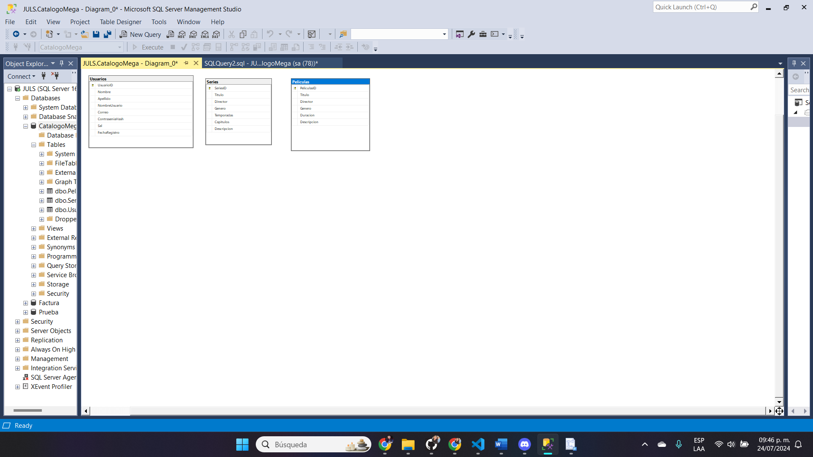
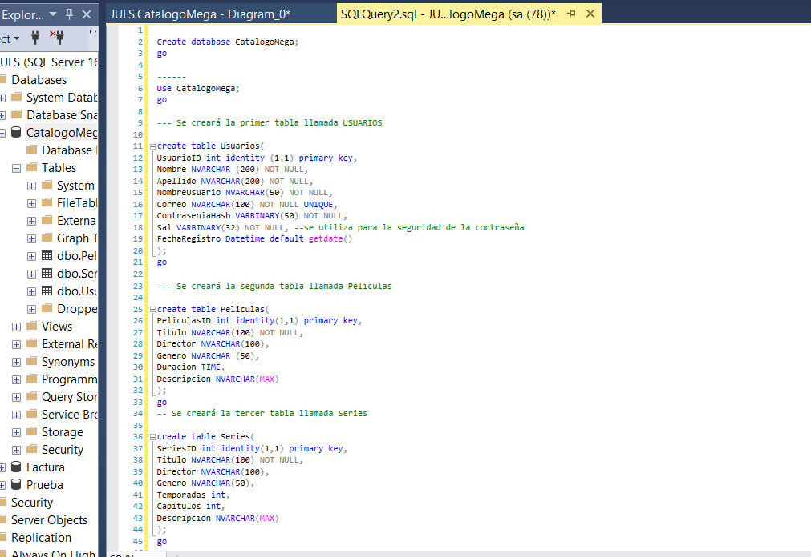
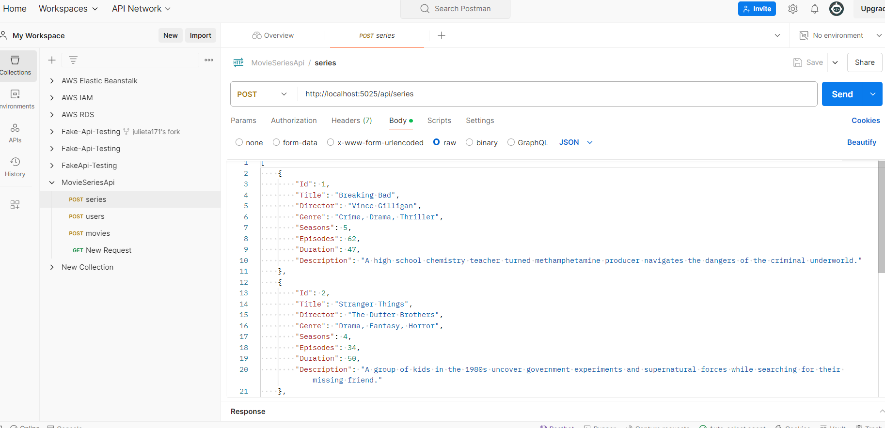
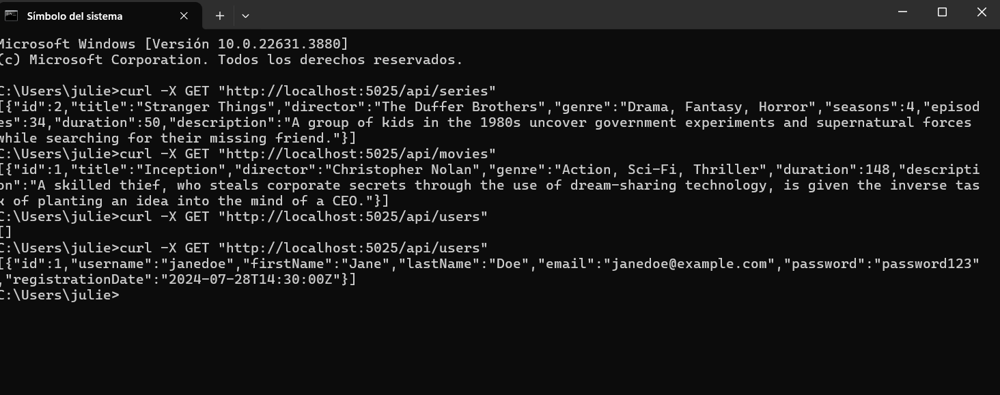
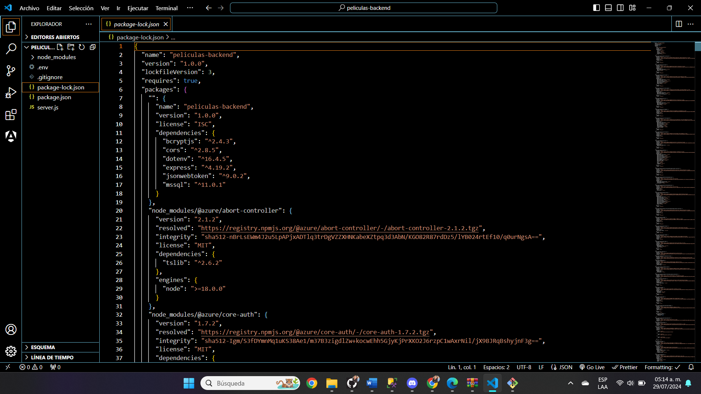

# BACKEND

# Autor
Julieta Jiménez

# Objetivos Principales REPO 4
* Crear una base de datos utilizando SQL Server e implementarla en la página de Películas.
* Por medio de Express enlazar  datos a la página
* Realizar un diagrama de Identidad relación de nuestaras tablas de datos.
  
 # Programas utilizados en REPO 4
* Express
* SQL Server
* c#
  
  # Descripción
  Para lograr la entrega fue necesario ver los cursos de SQL que ofrece la plataforma de Liderly, gracias a ellos se pudo crear una base de datos que ocuparemos en nuestra Hub Movies,
  se nos pidió usar Express para realización de nuestra API, se nos hizo mención de que ocuparíamos c#, por lo que tomé a decisión de iniciarla de esa forma, estoy trabajando con dos compañeros,
  los cuales nos hemos dado a la tarea de dividirnos las actividades y reunirnos por medio de Discort para discutir los avances, errores, tips que podamos implementar.

  ~¿Qué hice mal?~
* No gestioné bien mi tiempo y me enfoqué en querer arreglar mi página del repositorio pasado.
* No terminar satisfactoriamente el proyecto.
* No poder entrelazar la base de datos con express, lo que me hizo iniciar le proyecto de la backend con c#
* Tuve problemas con las versiones de mi Net9, me cambié a Net8.

  
  ~¿Que hice bien?~
  * Acercarme a mis compañeros y comprender mejor lo que estaba haciendo.
  * Realización de la base de datos de SQL. 
  
~¿Qué puedo hacer diferente?~
* Consultar a expertos en el área para hacer preguntas.
* Ahora que trabajo con mis compañeros, seguir dividiendo las tareas y tener muy buena comunicación para que funcione.
* Gestionar mejor mi tiempo y no quedarme demasiado tiempo en los errores.

   # Resultado Actualizado de lo que estaba realizando
    
Diagrama E-R

  
  En la imagen podemos ver que aún no coloco una relación entre ellas ya que es la manera más sencilla.

    
Creación de la base de datos

  

  Ya se agregaron datos a las tablas asegurando la seguridad en la contraseña.

   
    
Usando c# y Postman

  
  Para poder comprobar la API se utilizó postman con datos en Usuarios, Series, Peliculas.

    
Pruebas de la API

  
  Las pruebas fueron realizadas en la terminal con el cuál arrojaban datos agregados a la API.

  
Con Express

  
  Esta es la base de datos usando Express.
  
